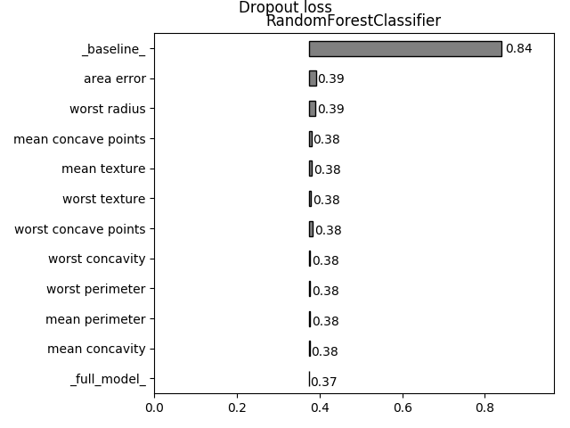

Usage
=====
Package can be used to establish the features importance for any classifiaction or regression model. You can present the result in text and graphical form. Additonally, you can present a few plots on the one graphics.

Method description
------------------
The functionality is based on the comparison of the loss function value for two models. The first model is the full one. In the second, values for the one variable are shuffled. In order to minimize the influence of randomness, the number of algorithm iteration was added. The final result is obtained as the mean of the results from the all iterations.

Installation
------------

.. code:: sh
   git clone https://github.com/Noctiphobia/variable-dropout/
   cd variable-dropout
   python setup.py install

If python resolves to Python 2, replace it with python3.

Requirements
------------

- python 3.6
- scikit-learn 0.19.1 
- numpy 1.11.3
- pandas 0.22.0
- matplotlib 2.2.0

Basic usage
-----------

Load dataset
~~~~~~~~~~~~

Import necessary packages.

.. code:: python
	
   from sklearn import datasets
   from sklearn.ensemble import RandomForestClassifier
   from sklearn.linear_model import LogisticRegression
   import sklearn as sk
   import numpy as np
   from xgboost import XGBClassifier
	

Import data, extract input dataset and a target vector.
	

.. code:: python

   dataset = datasets.load_breast_cancer()
   data = pd.DataFrame(dataset.data)
   target = dataset.target
   data.columns = dataset.feature_names
   

Prepare models
~~~~~~~~~~~~~~~

Create a classification or a regression model.

.. code:: python

   model_rf = RandomForestClassifier()
   model_lr = LogisticRegression()
   model_xgb = XGBClassifier()

Train models
~~~~~~~~~~~~~

Train models on data.

.. code:: python

   model_rf.fit(X = data, y = target)
   model_lr.fit(X = data, y = target)
   model_xgb.fit(X = data, y = target)

Get features importance
~~~~~~~~~~~~~~~~~~~~~~~

Compute features importance for models.

.. code:: python

   importance_rf = variable_dropout(model_rf, data, target, loss_function=sk.metrics.hinge_loss, random_state=rng)
   importance_lr = variable_dropout(model_lr, data, target, loss_function=sk.metrics.hinge_loss, random_state=rng)
   importance_xgb = variable_dropout(model_xgb, data, target, loss_function=sk.metrics.hinge_loss, random_state=rng)
   

Text form of importance
~~~~~~~~~~~~~~~~~~~~~~~~

Display computed importance for a model.

.. code:: python

   importance_rf

::

	0                _baseline_       0.84005  RandomForestClassifier
	1                worst area       0.44505  RandomForestClassifier
	2           worst perimeter       0.40254  RandomForestClassifier
	3          worst smoothness       0.37953  RandomForestClassifier
	4            mean concavity       0.37759  RandomForestClassifier
	5       mean concave points       0.38145  RandomForestClassifier
	6             worst texture       0.37810  RandomForestClassifier
	7          mean compactness       0.37568  RandomForestClassifier
	8              mean texture       0.37818  RandomForestClassifier
	9              radius error       0.37554  RandomForestClassifier
	10     worst concave points       0.37553  RandomForestClassifier
	11              mean radius       0.37478  RandomForestClassifier
	12           mean perimeter       0.37550  RandomForestClassifier
	13         smoothness error       0.37595  RandomForestClassifier
	14          worst concavity       0.37503  RandomForestClassifier
	15                mean area       0.37523  RandomForestClassifier
	16          mean smoothness       0.37425  RandomForestClassifier
	17            mean symmetry       0.37425  RandomForestClassifier
	18   mean fractal dimension       0.37425  RandomForestClassifier
	19            texture error       0.37479  RandomForestClassifier
	20          perimeter error       0.37425  RandomForestClassifier
	21               area error       0.37512  RandomForestClassifier
	22        compactness error       0.37574  RandomForestClassifier
	23          concavity error       0.37425  RandomForestClassifier
	24     concave points error       0.37425  RandomForestClassifier
	25           symmetry error       0.37425  RandomForestClassifier
	26  fractal dimension error       0.37510  RandomForestClassifier
	27        worst compactness       0.37439  RandomForestClassifier
	28           worst symmetry       0.37464  RandomForestClassifier
	29  worst fractal dimension       0.37431  RandomForestClassifier
	30             worst radius       0.37306  RandomForestClassifier
	31             _full_model_       0.37425  RandomForestClassifier
               
  
    

Visual form of importance
~~~~~~~~~~~~~~~~~~~~~~~~~~~

Visualize importance for one model.

.. code:: python

   plot_variable_dropout(importance_rf)

   
   
Visualize importance for multiple models.

   
.. code:: python

   plot_variable_dropout(importance_rf, importance_lr,importance_xgb)
   
.. figure:: pic2.png
   :alt: png

   

